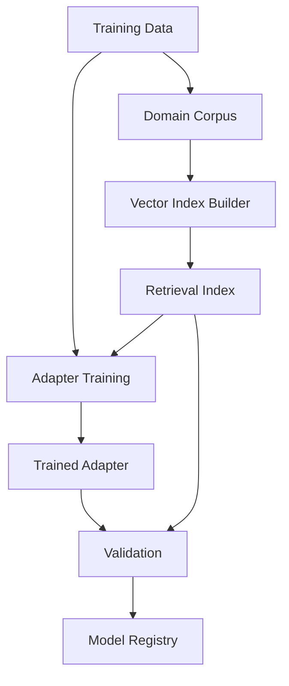
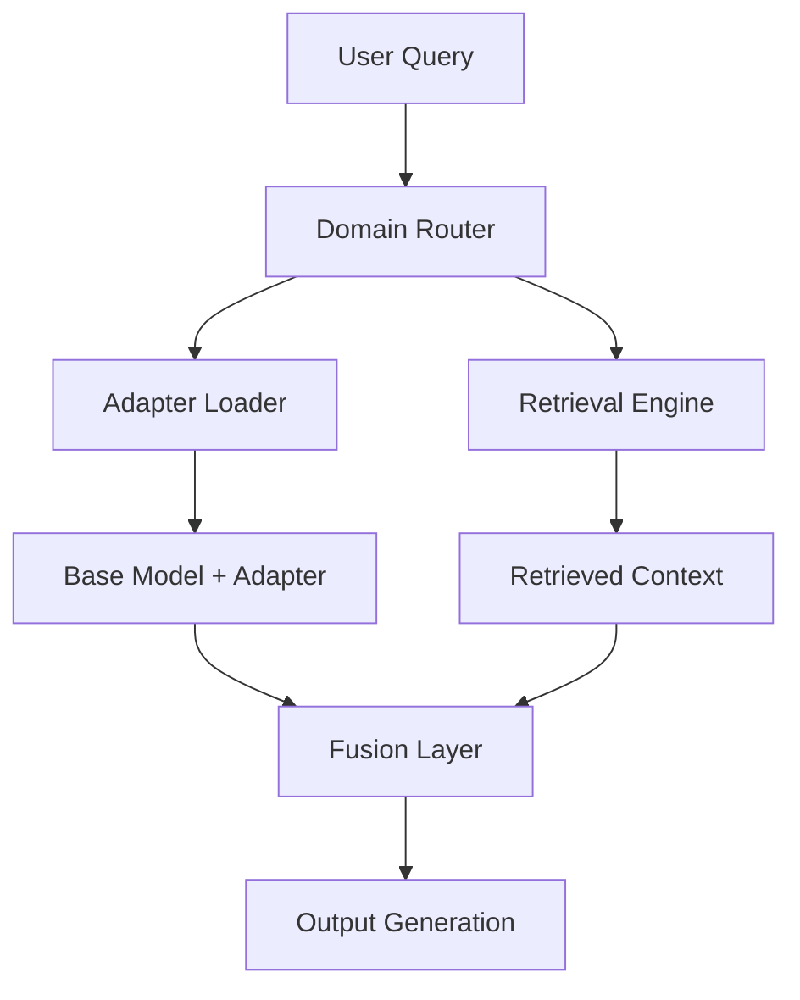

# Architecture Documentation

## System Overview

Retro-PEFT-Adapters is a library that combines Parameter-Efficient Fine-Tuning (PEFT) methods with Retrieval-Augmented Generation (RAG) to enable efficient domain adaptation for large language models. The system architecture is designed around three core principles:

1. **Parameter Efficiency**: Minimize trainable parameters through adapter-based architectures
2. **Retrieval Integration**: Seamlessly incorporate external knowledge through vector databases
3. **Production Scalability**: Support high-throughput serving with caching and optimization

## High-Level Architecture

```
┌─────────────────────────────────────────────────────────────────┐
│                        Client Applications                       │
├─────────────────────────────────────────────────────────────────┤
│                    API Gateway & Routing                        │
├─────────────────────────────────────────────────────────────────┤
│     Adapter Pool     │    Retrieval Engine    │   Cache Layer   │
├─────────────────────────────────────────────────────────────────┤
│                      Base Model Infrastructure                   │
├─────────────────────────────────────────────────────────────────┤
│          Vector Databases          │     Storage Backend       │
└─────────────────────────────────────────────────────────────────┘
```

## Core Components

### 1. Adapter Layer (`retro_peft/adapters/`)

The adapter layer implements various parameter-efficient fine-tuning methods enhanced with retrieval capabilities:

- **RetroLoRA**: Low-Rank Adaptation with retrieval integration
- **RetroAdaLoRA**: Adaptive rank allocation based on retrieval importance
- **RetroIA3**: Lightweight adapters with scaled retrieval injection
- **RetroPrefixTuning**: Prefix-based adaptation with retrieval context

#### Data Flow

```
Input Query → Domain Router → Adapter Selection → Retrieval Query
     ↓              ↓              ↓                    ↓
Base Model ← Adapter Fusion ← Retrieved Context ← Vector Database
     ↓
Output Generation
```

### 2. Retrieval Engine (`retro_peft/retrieval/`)

The retrieval engine manages knowledge extraction and integration:

#### Components
- **Indexers**: Build and maintain vector indices from domain corpora
- **Retrievers**: Execute similarity search and result ranking
- **Rerankers**: Post-process retrieved documents for relevance

#### Supported Backends
- **FAISS**: High-performance similarity search for large-scale retrieval
- **Qdrant**: Vector database with filtering and payload support
- **Weaviate**: GraphQL-based vector search with semantic capabilities

### 3. Fusion Mechanisms (`retro_peft/fusion/`)

Integration strategies for combining retrieved knowledge with adapter outputs:

- **Attention-based Fusion**: Cross-attention between adapter states and retrieved embeddings
- **Gated Fusion**: Learnable gates to control retrieval influence
- **Hierarchical Fusion**: Multi-level integration across transformer layers

### 4. Caching System (`retro_peft/caching/`)

Multi-tier caching for performance optimization:

- **K/V Cache**: Frozen attention states for domain-specific contexts
- **Adapter Cache**: Pre-computed adapter states for common queries
- **Retrieval Cache**: Cached embeddings and search results

## Component Interactions

### Training Pipeline



### Inference Pipeline



## Data Flow Architecture

### 1. Query Processing
1. **Input**: User query received via API endpoint
2. **Routing**: Domain classification determines appropriate adapter
3. **Retrieval**: Parallel query execution against vector databases
4. **Fusion**: Integration of retrieved context with adapter processing

### 2. Knowledge Integration
1. **Embedding**: Query and document encoding using shared embedding space
2. **Search**: Similarity-based retrieval with optional filtering
3. **Reranking**: Cross-encoder scoring for relevance optimization
4. **Context**: Integration into transformer attention mechanism

### 3. Response Generation
1. **Attention**: Modified attention computation with retrieval context
2. **Generation**: Autoregressive decoding with retrieval-aware sampling
3. **Postprocessing**: Response filtering and citation extraction

## Scalability Considerations

### Horizontal Scaling
- **Stateless Services**: All components designed for horizontal scaling
- **Load Balancing**: Request distribution across adapter instances
- **Database Sharding**: Vector index partitioning by domain/time

### Performance Optimization
- **Quantization**: 4-bit and 8-bit model quantization support
- **Batching**: Dynamic batching for throughput optimization
- **Caching**: Multi-level caching to reduce computational overhead

### Resource Management
- **Memory**: Adaptive memory allocation based on query complexity
- **Compute**: GPU memory optimization for large model inference
- **Storage**: Efficient vector index compression and storage

## Security Architecture

### Data Protection
- **Encryption**: At-rest and in-transit data encryption
- **Access Control**: Role-based access to adapters and indices
- **Audit Logging**: Comprehensive request and access logging

### Model Security
- **Isolation**: Adapter sandboxing to prevent cross-domain leakage
- **Validation**: Input sanitization and output filtering
- **Monitoring**: Anomaly detection for unusual query patterns

## Configuration Management

### Environment Configuration
```yaml
production:
  model:
    base_model: "meta-llama/Llama-2-7b-hf"
    quantization: "4bit"
    max_memory: "20GB"
  
  retrieval:
    backend: "qdrant"
    index_path: "/data/indices/"
    cache_size: "10GB"
  
  serving:
    workers: 4
    max_batch_size: 32
    timeout: 30
```

### Adapter Configuration
```yaml
adapters:
  medical:
    type: "RetroLoRA"
    rank: 16
    alpha: 32
    target_modules: ["q_proj", "v_proj"]
    retrieval_layers: [10, 11, 12]
  
  legal:
    type: "RetroAdaLoRA"
    initial_rank: 64
    target_rank: 8
    adaptation_rate: 0.1
```

## Monitoring & Observability

### Metrics Collection
- **Request Metrics**: Latency, throughput, error rates
- **Model Metrics**: Token generation speed, memory usage
- **Retrieval Metrics**: Search latency, relevance scores

### Health Checks
- **Service Health**: Component availability and response times
- **Model Health**: Memory usage and inference capability
- **Data Health**: Index freshness and search quality

## Future Architecture Considerations

### Planned Enhancements
1. **Multi-Modal Support**: Integration of vision and audio modalities
2. **Federated Learning**: Distributed adapter training across organizations
3. **Real-time Adaptation**: Online learning from user interactions
4. **Graph Integration**: Knowledge graph integration for structured retrieval

### Scalability Roadmap
1. **Edge Deployment**: Lightweight adapters for edge computing
2. **Cloud Integration**: Native cloud service integrations
3. **Streaming**: Real-time data ingestion and index updates
4. **Global Distribution**: Multi-region deployment with data locality